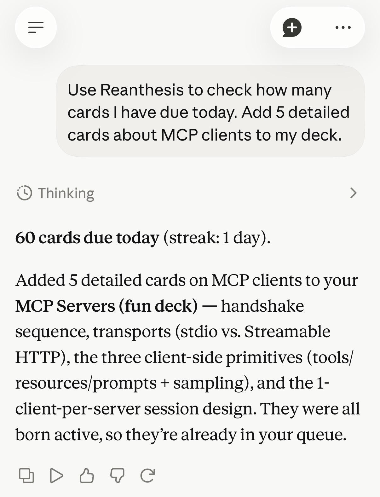
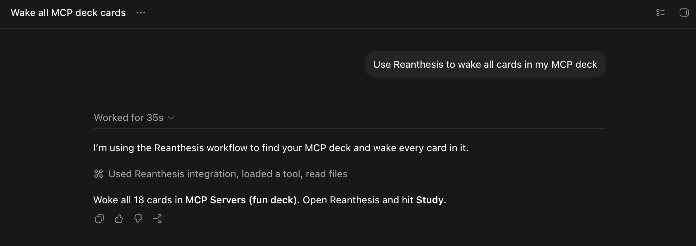

# use-reanthesis

Connect your AI to [Reanthesis](https://reanthesis.com), spaced repetition
for serious exams.

Your AI reads your lecture notes, drafts sharp flashcards, and files them into
your decks through the hosted MCP server at `https://reanthesis.com/mcp`. You
open Reanthesis and study. There is nothing to install or run: connecting is a
URL and one **Allow** tap.

## Connect

| Client | Setup |
| --- | --- |
| Claude (claude.ai, desktop, iOS) | Settings → Connectors → **Add custom connector** → `https://reanthesis.com/mcp` |
| ChatGPT | Settings → Connectors (developer mode) → `https://reanthesis.com/mcp` |
| Claude Code | `claude mcp add --transport http reanthesis https://reanthesis.com/mcp` |
| Codex CLI | `codex mcp add reanthesis --url https://reanthesis.com/mcp` |
| VS Code · Copilot | Add an HTTP MCP server with the same URL |

Your browser opens the Reanthesis authorize screen; sign in if needed and tap
**Allow**. You need an existing Reanthesis account — a connector can never
create one, and it can never touch billing or account settings.

## Plugins

For clients with a plugin system, the plugin bundles the connector and the
card-craft skill together, so one install is a complete setup.

Claude Code:

```text
/plugin marketplace add Reanthesis/use-reanthesis
/plugin install reanthesis@reanthesis
```

Codex CLI and the Codex desktop app: `codex plugin marketplace add
Reanthesis/use-reanthesis`, then `codex plugin add reanthesis@reanthesis` and
start a new thread. The Codex plugin includes the hosted MCP connector; the
first tool call opens its OAuth connection. If Reanthesis was already
installed, update or reinstall the plugin so it picks up the connector
declaration. Copilot CLI uses the same two `/plugin` commands as Claude Code.

### Plugins in use

Claude plugin in use:



Codex plugin in use:



## The skill

[`skills/reanthesis`](skills/reanthesis/SKILL.md) teaches an AI the craft
before it touches a tool: read the whole source, check what
already exists, propose the batch, then create. Focused references cover the
craft: [creating cards](skills/reanthesis/references/creating-cards.md),
[waking dormant cards](skills/reanthesis/references/waking-dormant-cards.md),
and [turning AI work into cards](skills/reanthesis/references/turning-ai-work-into-cards.md).
The waking-card loop keeps a growing collection studyable. Hosted clients without
skills (claude.ai, ChatGPT) receive the same guidance from the server itself
at connection time.

## What your AI can do

The server exposes 13 tools, scoped to card tending:

- `whoami`, `study_status` — connection health and the study dashboard.
- `list_decks`, `create_deck`, `list_cards` — navigate the collection.
- `create_card`, `create_cloze`, `update_card`, `delete_card` — author notes,
  including `{{c1::...}}` cloze deletions.
- `wake_cards`, `rest_cards`, `find_tags` — move material between active
  (in the study queue) and dormant (paused, progress kept), by tag, deck, or
  card.
- `upload_image` — attach diagrams that are themselves the study content.

The full contract is in [docs/mcp-tools.md](docs/mcp-tools.md).

## Auth and privacy

Connecting uses OAuth 2.1 (authorization code + PKCE), discovered
automatically from the server URL. Approval mints an opaque connector token,
stored hashed server-side, valid 180 days, revoked by a password reset. The
token is scoped server-side, deny by default: it can tend cards and read
study state, and the API refuses everything else — account, billing,
membership, exports, imports, and review submission. Your AI builds and tends
cards; only you study them.

Inference stays yours: your AI reads your material with your subscription.
Reanthesis stores cards and study state, schedules with FSRS, and adds no
third-party inference or analytics to this integration. Details in
[docs/auth.md](docs/auth.md).

## Roadmap

- Connector-registry listings, so adding Reanthesis becomes a toggle instead
  of a URL.
- OAuth refresh tokens.
- Image-occlusion and cluster tools.
- Bulk import.

## License

[Apache License 2.0](LICENSE). Copyright 2026 Agent Horizon LLC.
